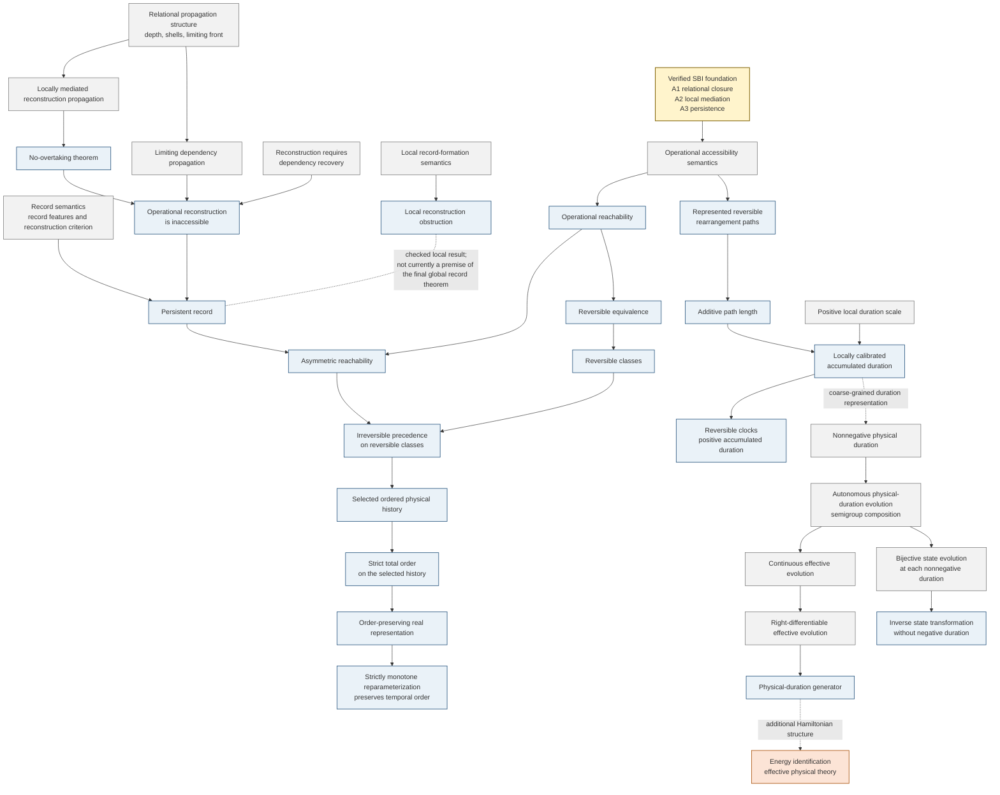

# Time top-level dependency map

**Manuscript:** *The Structure of Time*  
**Purpose:** human-readable top-level dependency map and source for manuscript Figure 1  
**Formal entry point:** `SBILeanProject/Time.lean`

This map is deliberately curated at the conceptual level rather than generated by
expanding every Lean declaration.  Every solid arrow corresponds to a dependency
represented in the current Lean development.  Dashed arrows mark an interpretive
or additional effective-physics step rather than a theorem derived solely from the
preceding Lean declarations.

## Lean anchors

| Figure node | Principal Lean location / declaration |
|---|---|
| Operational accessibility semantics | `Time/Basic.lean` — `OperationalAccessibilitySemantics` |
| Operational reachability | `Time/Basic.lean` — `OperationalReachability` |
| Reversible equivalence / classes | `Time/Reachability.lean` — `ReversibleEquivalent`, `ReversibleClass` |
| Asymmetric reachability | `Time/Reachability.lean` — `AsymmetricReachability` |
| Irreversible precedence | `Time/Reachability.lean` — `IrreversiblePrecedence` |
| Selected ordered physical history | `Time/TemporalOrder.lean` — `OrderedPhysicalHistory` |
| Strict total order on selected history | `Time/TemporalOrder.lean` — `historyPrecedence_isStrictTotalOrder` |
| Real order representation | `Time/TemporalOrder.lean` — `history_orderEmbedsIntoReal` |
| Monotone reparameterization | `Time/TemporalOrder.lean` — `strictMono_reparametrization_preserves_temporalOrder` |
| Record semantics | `Time/Records.lean` — `RecordFeatureSemantics`, `PersistentRecord` |
| Local record-formation semantics | `Time/RecordFormation.lean` — `LocalRecordFormationSemantics` |
| Local reconstruction obstruction | `Time/RecordFormation.lean` — `local_reconstruction_obstruction` |
| Relational propagation structure | `Time/RecordFormation.lean` — propagation depth, shells, and limiting front declarations |
| No-overtaking | `Time/RecordFormation.lean` — `cannot_overtake_limiting_front` |
| Reconstruction requires dependency recovery | `Time/RecordFormation.lean` — `ReconstructionRequiresDependencyRecovery` |
| Reconstruction inaccessible | `Time/RecordFormation.lean` — `not_operationally_reconstructible` |
| Persistent record from limiting dependency | `Time/RecordFormation.lean` — `persistentRecord_of_limiting_dependency` |
| Persistent record implies asymmetric reachability / precedence | `Time/Records.lean` — `PersistentRecord.asymmetricReachability`, `PersistentRecord.irreversiblePrecedence` |
| Reversible rearrangement paths | `Time/ReversibleExploration.lean` — `ReversibleRearrangementPath` |
| Additive path length | `Time/ReversibleExploration.lean` — `pathLength`, `pathLength_append` |
| Local duration calibration | `Time/Duration.lean` — `LocalDurationScale`, `accumulatedDuration` |
| Reversal preserves positive accumulated duration | `Time/Duration.lean` — `accumulatedDuration_reverse` |
| Reversible clocks | `Time/Duration.lean` — `ReversibleClock`, `durationAfterCycles_strictMono` |
| Nonnegative physical duration | `Time/PhysicalDurationEvolution.lean` — `PhysicalDuration` |
| Autonomous physical-duration evolution | `Time/PhysicalDurationEvolution.lean` — `AutonomousPhysicalDurationEvolution` |
| Continuous physical-duration evolution | `Time/PhysicalDurationEvolution.lean` — `ContinuousAutonomousPhysicalDurationEvolution` |
| Right-differentiable physical-duration evolution | `Time/PhysicalDurationEvolution.lean` — `RightDifferentiableAutonomousPhysicalDurationEvolution` |
| Physical-duration generator | `Time/PhysicalDurationEvolution.lean` — `generator`, `derivWithin_incremented_duration` |
| Reversible state transformation without negative duration | `Time/PhysicalDurationEvolution.lean` — `ReversibleAutonomousPhysicalDurationEvolution`, `evolveEquiv`, `inverse_after_evolve`, `evolve_after_inverse` |
| Energy identification | Manuscript-level additional Hamiltonian structure; not derived from A1--A3 and not encoded as a theorem in this Time layer |

## Scope note

The older signed effective-flow modules
`EffectiveEvolution.lean`, `ContinuousEvolution.lean`, and
`Generator.lean` remain in the repository as an auxiliary mathematical
description of a selected reversible one-parameter flow.  They are intentionally
not placed on the central physical-duration branch of this figure: their real
parameter is an auxiliary signed displacement, not accumulated physical duration.

The local reconstruction-obstruction theorem is also shown separately.  In the
current formal development it is a verified local result, but it is not used as a
premise of `persistentRecord_of_limiting_dependency`.  The final global record
theorem instead uses the explicit dependency-recovery bridge together with the
limiting-propagation/no-overtaking structure.  The figure preserves that distinction
rather than implying a dependency that Lean does not presently contain.
